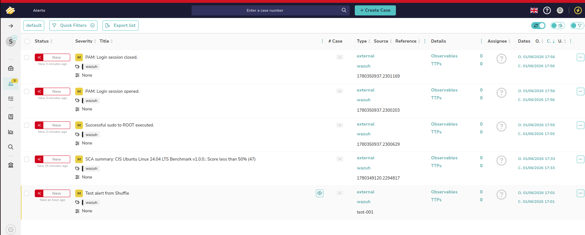
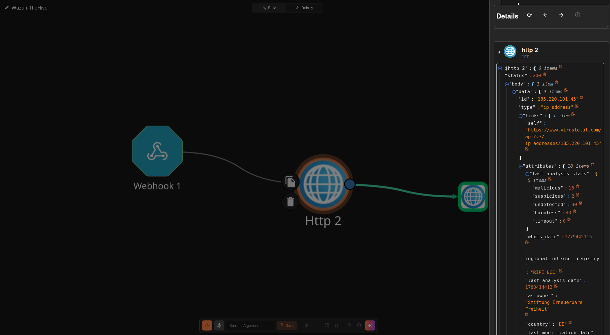
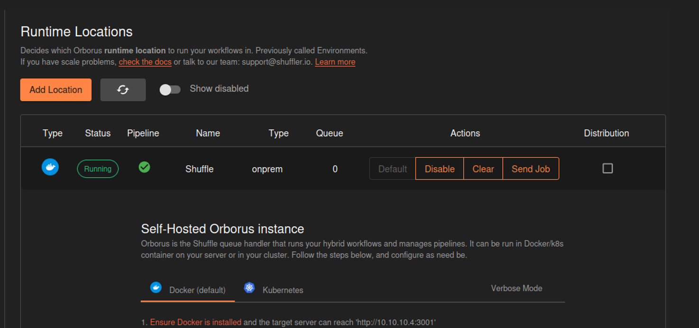

# SOAR Pipeline — Automated Detection to Case Management


An automated detection-to-case pipeline that ingests Wazuh security alerts, enriches IOCs through the VirusTotal API, and creates structured, pre-populated cases in TheHive — eliminating manual alert handling between detection and case management.

---

## Pipeline Overview

```
Wazuh XDR/SIEM  (<wazuh_ip>)
     │
     │  Webhook — JSON alert payload (level 3+)
     ▼
Shuffle SOAR  (<soar_ip>:3001)
     │
     ├─── Http node → VirusTotal v3 API
     │         └── Malicious count, reputation score, country, tags
     │
     └─── Http node → TheHive API
               └── Pre-populated alert with embedded threat intel
                         ▼
               TheHive Case Management  (<soar_ip>:9000)
                    └── Structured alert ready for analyst triage
```

---

## Why I Built This

Without automation, a SOC analyst receiving a raw Wazuh alert has to manually open TheHive, create a ticket, copy alert details into the case, separately query VirusTotal for the source IP, paste findings back into the case, and assign it for investigation — five manual steps per alert, every time.

This pipeline collapses all five steps into zero manual actions. The analyst opens TheHive and finds a fully populated case with VirusTotal threat intelligence already embedded, ready for triage and response. At scale, this eliminates hundreds of repetitive actions per shift and ensures no alert goes untracked.

I chose TheHive as the case management layer because it provides the audit trail that incident response standards require — every action, note, and status change is logged with a timestamp and username. Unlike a raw alert queue, TheHive enforces a case lifecycle (New → In Progress → Closed) with assignee tracking, so alerts can't be double-handled or silently dropped.

---

## Stack

| Component | Role | Version |
|-----------|------|---------|
| Wazuh | XDR/SIEM — threat detection and alert generation | 4.x |
| Shuffle | SOAR — workflow automation and orchestration | Latest |
| TheHive | Case management — structured alert lifecycle and audit trail | 5.4.9 |
| VirusTotal | Threat intelligence — IOC enrichment via API | v3 API |
| OpenSearch | Shuffle backend database | 3.2.0 |
| Cassandra | TheHive graph database backend | 4.1.x |
| Docker / Compose | Container orchestration for Shuffle stack | 29.1.3 / 1.29.2 |

---

## Network Architecture

```
┌─────────────────────────────────────────────────────────────┐
│                      pfSense Firewall                        │
└──────┬──────────────────────────────────┬────────────────────┘
       │                                  │
┌──────▼──────────┐             ┌─────────▼──────────────────┐
│   AD_LAB        │             │   SECURITY (10.10.10.0/24) │
│  10.80.80.0/24  │             │                            │
│                 │  Wazuh      │  Wazuh Manager  10.10.10.3 │
│  DC1 (Agent)    │─ Agent ────▶│  Shuffle        10.10.10.4 │
│  Win10-User1    │  Events     │  TheHive        10.10.10.4 │
│  Win10-User2    │             │                            │
└─────────────────┘             └────────────────────────────┘
```

AD_LAB and SECURITY segments are isolated by pfSense firewall rules. Only Wazuh agent traffic is permitted across the boundary — the pipeline runs entirely within the SECURITY segment.

---

## How the Workflow Works

### Alert Ingestion
Wazuh's integratord fires a webhook to Shuffle for any alert at rule level 3 or above. The JSON payload carries the rule ID, severity, title, timestamp, and the `all_fields` object which contains IOC data such as source IP, destination IP, and port depending on the alert type.

### VirusTotal Enrichment
Shuffle extracts `$exec.all_fields.data.srcip` from the webhook payload and queries the VirusTotal v3 IP reputation endpoint. The response returns vendor verdicts, reputation score, ASN ownership, country, and tags such as Tor exit node classification. These fields are stored in the `$http_2` variable and passed downstream to the TheHive node.

### TheHive Alert Creation
Shuffle POSTs to TheHive's `/api/v1/alert` endpoint with the Wazuh alert metadata and the VirusTotal results embedded in the description field. The alert is created in the SOC organisation under the `shuffle@thehive.local` service account, tagged with the source IP, and immediately visible to analysts.

---

## Alert Output Example

```
Title:       Multiple failed SSH login attempts
Source:      wazuh
Reference:   <wazuh_alert_id>
Tags:        wazuh | <source_ip>
Severity:    MEDIUM
Created by:  Shuffle

Description:
  WAZUH Alert - Rule: 5763
  Source IP: <source_ip>

  VirusTotal Results:
  - Malicious: 16
  - Suspicious: 2
  - Reputation: -21
  - Country: DE
```

*TheHive alert with embedded VirusTotal enrichment — created automatically by Shuffle within seconds of the Wazuh detection:*



---

## Workflow Canvas

*Three-node Shuffle workflow — Webhook trigger → VirusTotal enrichment → TheHive case creation:*



---

## Orborus Status

*Shuffle Orborus registered and running — confirms the workflow execution engine is active and connected to the backend:*



---

## Observed Alert Types

The following alert types are currently flowing through the pipeline from the lab environment:

| Rule ID | Description | Agent |
|---------|-------------|-------|
| 5402 | Successful sudo to ROOT executed | Wazuh Linux |
| 5502 | PAM login session events | Wazuh Linux |
| 5763 | Multiple failed SSH login attempts | Wazuh Linux |
| 19004 | SCA CIS Benchmark score < 50% | Wazuh Linux |
| 60137 | Windows User Logoff | DC1 Windows Agent |

---

## Key Engineering Decisions

**Lucene over Elasticsearch for TheHive's index backend.** TheHive 5's bundled JanusGraph graph engine is incompatible with both ES 7.x and ES 8.x in non-standard port configurations. After exhausting both, I switched to Lucene — which is StrangeBee's own recommendation for single-node deployments — eliminating the dependency entirely and freeing ~600MB of RAM.

**Shuffle's swarm mode disabled.** Shuffle defaults to Docker Swarm for worker orchestration, which breaks in single-node deployments — swarm DNS fails, network attachment errors cascade, and workers spawn with empty image tags. Setting `SHUFFLE_SWARM_CONFIG=inactive` in both the `.env` and `docker-compose.yml` (the compose file hardcodes `run` and overrides `.env`) resolved all worker execution failures.

**TheHive service account scoped to SOC org.** TheHive 5's permission system is organisation-scoped, not global. The `manageAlert` permission only exists within a non-admin organisation context. I created a dedicated SOC org, assigned the Shuffle service account `org-admin` role within it, and set SOC as the default — removing the admin org membership entirely.

**OpenSearch heap capped at 1GB.** Default OpenSearch configuration consumed 3.7GB of the VM's 14GB RAM, leaving insufficient headroom for Cassandra, TheHive, and the Shuffle stack. Capping via `OPENSEARCH_JAVA_OPTS=-Xms1g -Xmx1g` (Xms and Xmx must be equal or the bootstrap check fails) brought OpenSearch down to ~750MB at runtime.

---

## Troubleshooting Reference

A summary of the significant issues encountered during deployment. Full setup notes are in [SETUP-NOTES.md](./SETUP-NOTES.md).

### Shuffle / Docker

| Issue | Cause | Resolution |
|-------|-------|------------|
| Workers couldn't resolve `shuffle-backend` | Swarm DNS failing on single node | Set `OUTER_HOSTNAME=10.10.10.4` in `.env` |
| `invalid reference format` on worker containers | `SHUFFLE_WORKER_VERSION` empty — Docker API received image name with no tag | Set `SHUFFLE_WORKER_VERSION=latest` in Orborus environment |
| `SHUFFLE_SWARM_CONFIG` not respected | `docker-compose.yml` hardcodes `run`, overriding `.env` | Edit compose file directly |
| Orborus UUID mismatch after restart | Stale leader record persisting in OpenSearch | Cleared `orborus_uuid` and `running_ip` via OpenSearch API |
| OpenSearch bootstrap failure | `-Xms` and `-Xmx` values didn't match | Set both to `-Xms1g -Xmx1g` |
| DNS failures inside containers | `systemd-resolved` stub misbehaving | Added `10.10.10.1` and `8.8.8.8` to `/etc/docker/daemon.json` |

### TheHive / Cassandra

| Issue | Cause | Resolution |
|-------|-------|------------|
| Cassandra crash on startup | `UseBiasedLocking` JVM flag removed in Java 21 | Pinned to Java 11 via `update-alternatives` |
| JanusGraph ignoring Lucene config | Index backend written to Cassandra keyspace, overriding local config file | Dropped and recreated TheHive keyspace in cqlsh |
| ES 7/8 incompatibility | JanusGraph HTTP client unable to maintain connections | Switched to Lucene embedded index |
| TheHive repo unreachable | DNS resolution failures on StrangeBee's Debian repo | Downloaded `.deb` directly from `thehive.download.strangebee.com` |

### Integration

| Issue | Cause | Resolution |
|-------|-------|------------|
| TheHive 403 AuthorizationError | Shuffle service account's default org lacked `manageAlert` permission | Created SOC org, assigned `org-admin`, set as default, removed admin org |
| `BETA REPLACEMENT IMPLEMENTATION` errors | Corrupted TheHive app image cached in Shuffle | Removed containers and OpenSearch entry, re-pulled image |
| `$http_2` not accessible in TheHive node | Direct Webhook→TheHive connection bypassing VT node | Removed direct connection so flow is strictly Webhook→VT→TheHive |

---

## MITRE ATT&CK Coverage

| Technique | ID | Detection Source |
|-----------|-----|-----------------|
| Brute Force — SSH | T1110.004 | Wazuh rule 5763 |
| Sudo and Sudo Caching | T1548.003 | Wazuh rule 5402 |
| Valid Accounts | T1078 | Wazuh PAM rules |
| Active Scanning | T1595 | Network alert rules |

---

## Resource Usage (Steady State)

```
VM RAM:              14GB total
shuffle-opensearch:  ~1GB   (capped via OPENSEARCH_JAVA_OPTS)
TheHive JVM:         ~400MB
Cassandra JVM:       ~512MB
shuffle-backend:     ~75MB
shuffle-orborus:     ~30MB
OS + overhead:       ~4GB
Available:           ~5.5GB
```

---

## Setup Notes

Full installation notes, commands, and configuration files are documented in [SETUP-NOTES.md](./SETUP-NOTES.md). This covers the complete deployment of Docker, Cassandra, TheHive, Shuffle, and the Wazuh integration including all issues encountered and their resolutions.

---

## Related Projects

- [SOC-Home-Lab](../README.md) — Full lab architecture, network topology, and segment documentation
- [Attack Detections](../docs/attack-detections/README.md) — Full detection evidence captured from Wazuh XDR and Splunk SIEM
- [IR Reports](../docs/incident-reports/README.md) — Full incident response reports following NIST SP 800-61
